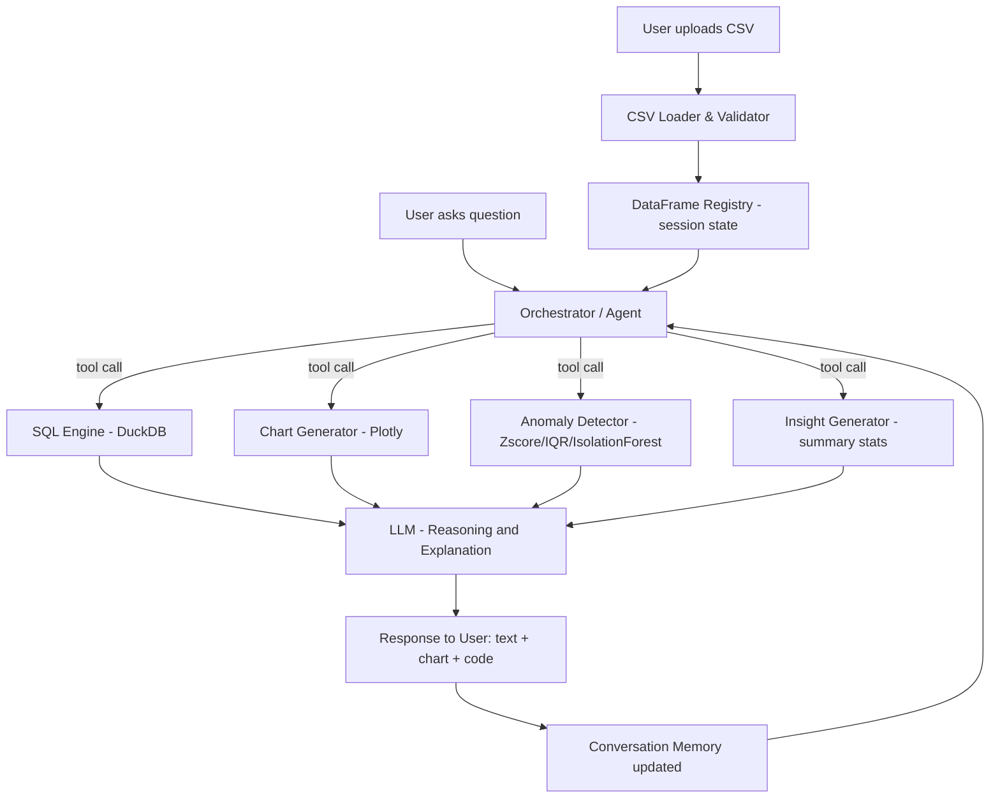

# Architecture — AI-Powered Data Analyst

## Overview
A conversational data analysis application. Users upload one or more CSV files and interact
with the data using natural language. An LLM acts as the reasoning/orchestration layer that
decides which analytical tool to invoke (SQL query, chart generation, anomaly detection,
summary statistics) and explains the result back to the user in plain language.

## Design Principles
- **LLM as orchestrator, not oracle**: the LLM never computes numbers itself. It calls tools
  (SQL/Pandas/stat functions) that produce ground-truth results, then explains them. This
  avoids hallucinated numbers — a common failure mode in naive "LLM + CSV" demos.
- **Session-scoped state**: each user session holds its own DataFrame registry and
  conversation history, so multiple users/files don't collide.
- **Tool-calling architecture**: the LLM is given a fixed set of tools (functions) with
  JSON schemas. It picks the tool(s) needed per query, rather than free-form code generation
  executed blindly.

## High-Level Flow

## Components

| Component | Responsibility | Tech |
|---|---|---|
| CSV Loader | Validate schema, dtypes, encoding, missing data | Pandas |
| DataFrame Registry | Hold uploaded datasets per session | In-memory dict (Redis for multi-instance prod) |
| Orchestrator | Interpret NL query, call the right tool(s) | LLM tool-calling (Claude/GPT) |
| SQL Engine | Run generated SQL directly on DataFrames | DuckDB |
| Chart Generator | Produce bar/line/pie/scatter charts | Plotly |
| Anomaly Detector | Flag outliers + reasoning | Z-score/IQR + optional Isolation Forest |
| Insight Generator | Descriptive stats, trends, top-N | Pandas |
| Conversation Memory | Maintain context across turns | In-memory list per session |
| LLM Client | Wraps API calls, handles tool-call loop | Claude/OpenAI SDK |

## Why DuckDB
DuckDB can query Pandas DataFrames directly with standard SQL, with zero setup — the LLM
generates SQL against the known schema, DuckDB executes it, and we get real (non-hallucinated)
numbers back. This directly satisfies "Generate SQL and/or Pandas code" without standing up a
real database.

## Request Lifecycle (Example)
1. User: "Which region generated the highest revenue?"
2. Orchestrator sends the question + dataset schema + tool definitions to the LLM.
3. LLM responds with a tool call: `run_sql(query="SELECT region, SUM(revenue) ... GROUP BY region ORDER BY ... LIMIT 1")`.
4. Backend executes the SQL via DuckDB, gets the real result.
5. Result is sent back to the LLM, which produces a natural-language answer + reasoning.
6. Response (text + optional chart) returned to the frontend; turn is added to memory.

## Deployment
- `docker-compose.yml` runs backend (FastAPI) + frontend (Streamlit) as two services.
- Stateless backend design (session state can move to Redis) makes horizontal scaling possible.

## Assumptions
- Single-user session model for this assignment scope (no multi-tenant auth required).
- LLM provider is pluggable behind `backend/llm/client.py` (Claude by default, OpenAI as fallback).
- Anomaly detection uses simple statistical methods by default; Isolation Forest is offered as
  an opt-in for numeric-heavy datasets.
